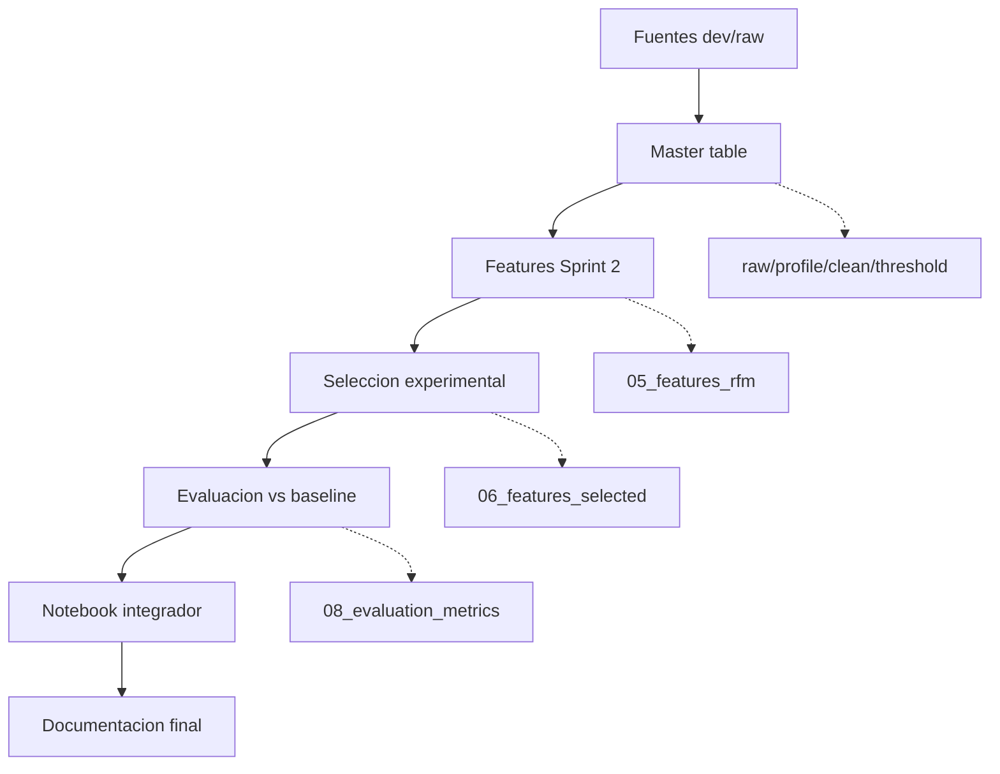
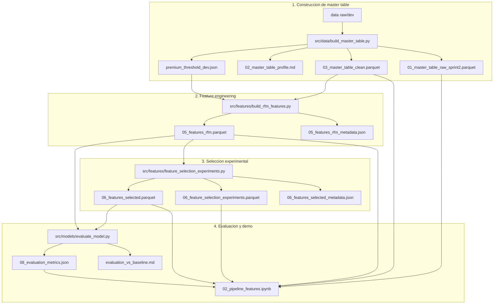
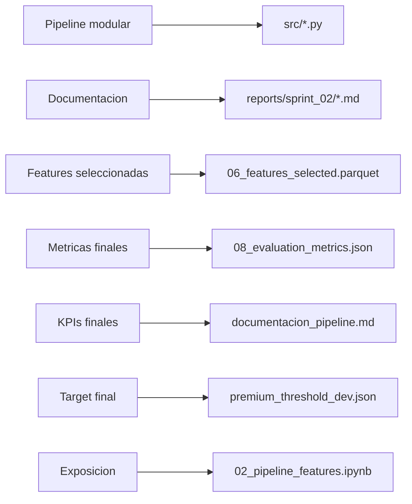

# DAG del Pipeline - Sprint 2

## Objetivo

Documentar el flujo real de ejecucion del Sprint 2, desde las fuentes de datos hasta la evaluacion final y el notebook integrador. Este DAG complementa el plan de implementacion y sirve como referencia operativa para reproducir los artefactos.

## DAG principal

Este diagrama muestra el flujo operativo que debe explicar el equipo. Mantiene solo las etapas principales para que sea legible en pantalla.



## DAG por capas

Este diagrama muestra scripts y artefactos sin cruzar todas las dependencias analiticas.



## Mapa de entregables

Este diagrama es util para exposicion porque conecta cada etapa con el entregable formal del sprint.



## Orden de ejecucion reproducible

Ejecutar desde la raiz del repo:

```bash
python3 src/data/build_master_table.py --profile-source dev --threshold-mode auto
python3 src/features/build_rfm_features.py
python3 src/features/feature_selection_experiments.py
python3 src/models/evaluate_model.py
```

El notebook integrador consume los artefactos anteriores:

```text
notebooks/sprint_02_pipeline/02_pipeline_features.ipynb
```

## Entradas y salidas por etapa

| Etapa | Script | Entrada principal | Salidas principales |
| --- | --- | --- | --- |
| Master table | `src/data/build_master_table.py` | `data/splits/temporal_2018q4/dev/*.parquet` | `01_master_table_raw_sprint2.parquet`, `02_master_table_profile.md`, `03_master_table_clean.parquet`, `premium_threshold_dev.json` |
| Features | `src/features/build_rfm_features.py` | `03_master_table_clean.parquet` | `05_features_rfm.parquet`, `05_features_rfm_metadata.json` |
| Seleccion experimental | `src/features/feature_selection_experiments.py` | `05_features_rfm.parquet` | `06_feature_selection_experiments.*`, `06_features_selected.parquet`, `06_features_selected_metadata.json` |
| Evaluacion | `src/models/evaluate_model.py` | `06_features_selected.parquet`, `05_features_rfm.parquet` | `08_evaluation_metrics.json`, `evaluation_vs_baseline.md` |
| Analisis | `02_pipeline_features.ipynb` | artefactos procesados | graficas, comparacion baseline vs Sprint 2, narrativa de defensa |

## Decisiones clave del DAG

- `select_features.py` no forma parte del flujo oficial; quedo deprecado para evitar sobrescribir la seleccion experimental.
- `feature_selection_experiments.py` es la fuente oficial de `06_features_selected.parquet`.
- El cutoff temporal oficial para seleccion y evaluacion es `2018-07-01`.
- El target usa umbral fijo `dev = 197.01`, persistido en `premium_threshold_dev.json`.
- La evaluacion final reportada corresponde al set experimental ganador `corr_le_0.85`.

## Validacion actual

- clientes en master table limpia: `96,096`
- duplicados por `customer_unique_id`: `0`
- tasa premium: `20.00%`
- features finales: `28`
- experimento ganador: `corr_le_0.85`
- `AUC-ROC validation`: `0.7929`
- `Gini validation`: `0.5858`
