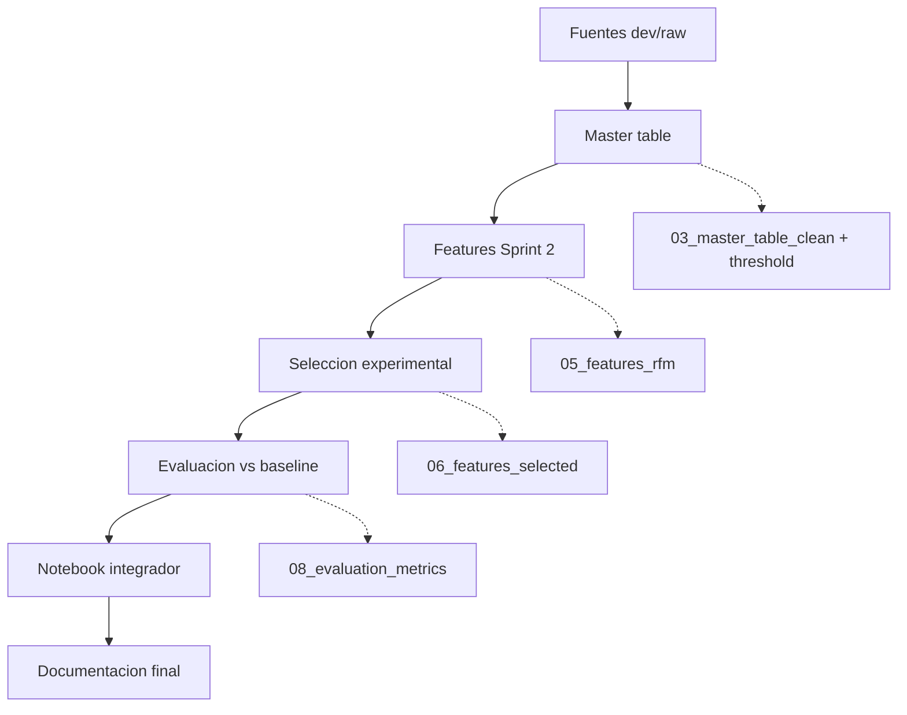

# Documentacion del Pipeline Sprint 2

## Objetivo

Documentar el flujo reproducible del Sprint 2 desde la construccion de la `master table` hasta la seleccion inicial de variables y su evaluacion metodologica.

## Flujo implementado

```text
Split dev / raw
-> build_master_table.py
-> master table raw
-> profiling de calidad
-> master table clean
-> umbral premium fijo basado en dev
-> build_rfm_features.py
-> feature_selection_experiments.py
-> features seleccionadas
```

El DAG tecnico completo esta documentado en `reports/sprint_02/dag_pipeline_sprint_2.md`.

## DAG resumido



## Orden de ejecucion

```bash
python3 src/data/build_master_table.py --profile-source dev --threshold-mode auto
python3 src/features/build_rfm_features.py
python3 src/features/feature_selection_experiments.py
python3 src/models/evaluate_model.py
```

## Artefactos generados

- `data/interim/01_master_table_raw_sprint2.parquet`
- `data/interim/02_master_table_profile.md`
- `data/processed/03_master_table_clean.parquet`
- `data/processed/master_table_dev.parquet`
- `data/processed/premium_threshold_dev.json`
- `data/processed/05_features_rfm.parquet`
- `data/processed/05_features_rfm_metadata.json`
- `data/processed/06_feature_selection_experiments.parquet`
- `data/processed/06_feature_selection_experiments.json`
- `data/processed/06_features_selected.parquet`
- `data/processed/06_features_selected_metadata.json`
- `data/processed/08_evaluation_metrics.json`
- `reports/sprint_02/dag_pipeline_sprint_2.md`
- `reports/sprint_02/evaluation_vs_baseline.md`
- `reports/sprint_02/feature_selection_experiments.md`

## Construccion de la master table

La logica del notebook `notebooks/sprint_01_eda/01_build_master_table.ipynb` fue trasladada a `src/data/build_master_table.py`.

Reglas principales:

- granularidad final por `customer_unique_id`
- metricas financieras basadas solo en pedidos `delivered`
- metricas operativas basadas en todas las ordenes disponibles del cliente
- imputacion minima a `0` para conteos y sumas clave

## Definicion del target

El target `is_premium` se mantiene como una etiqueta binaria basada en gasto acumulado de compras entregadas.

Para evitar que el target cambie en cada corrida del sprint, se adopto una politica de umbral fijo:

- primero se calcula `P80` sobre la poblacion `dev`
- ese valor se persiste en `data/processed/premium_threshold_dev.json`
- corridas posteriores reutilizan ese mismo umbral con modo `apply`

Valor fijado en esta rama:

- umbral premium `dev`: `197.01`

## Features creadas en Sprint 2

El modulo `src/features/build_rfm_features.py` genera features operativas, logisticas, de cuotas, geografia y categoria.

Features nuevas creadas:

- `items_per_order`
- `products_per_order`
- `max_to_avg_price_ratio`
- `freight_to_item_ratio`
- `installments_gt_1_flag`
- `installments_gt_6_flag`
- `credit_card_flag`
- `boleto_flag`
- `voucher_flag`
- `payment_complexity_flag`
- `has_late_delivery`
- `has_cancellation`
- `delivery_gap`
- `reviews_per_order`
- `region_group`
- `far_region_flag`
- `top_category_group`
- `top_category_is_high_value`

Nota sobre `top_category_is_high_value`:

- esta feature no usa la tasa premium de la categoria
- se define con el cuartil superior de `avg_item_price` por categoria
- la decision evita introducir leakage del target en la construccion de features

## Seleccion de variables

### Regla metodologica

La seleccion manual no se uso como criterio final.

Solo se uso como saneamiento preliminar para excluir:

- leakage directo
- identificadores
- fechas crudas
- proxies monetarias demasiado cercanas al target

La seleccion final se justifico con experimentacion reproducible en `src/features/feature_selection_experiments.py`.

### Tecnicas evaluadas

Se probaron los siguientes esquemas:

- `initial`
  - set base despues de exclusiones obligatorias
- `missing_le_0.10`
  - filtro por missing menor o igual a `10%`
- `corr_le_0.95`
  - filtro por correlacion absoluta entre variables numericas mayor a `0.95`
- `corr_le_0.90`
  - filtro por correlacion absoluta mayor a `0.90`
- `corr_le_0.85`
  - filtro por correlacion absoluta mayor a `0.85`
- `univariate_top_10pct`
  - seleccion del `10%` superior por `mutual_info_classif`
- `univariate_top_20pct`
  - seleccion del `20%` superior por `mutual_info_classif`
- `univariate_top_30pct`
  - seleccion del `30%` superior por `mutual_info_classif`

### Exclusiones obligatorias antes de experimentar

Se excluyeron de la busqueda final:

- `total_spent`
- `avg_ticket`
- `avg_order_price`
- `avg_item_price`
- `max_item_price`
- `avg_freight_value`
- `avg_freight_ratio`
- `freight_to_item_ratio`
- `customer_unique_id`
- `first_purchase`
- `last_purchase`
- `customer_city`
- `customer_zip_code_prefix`

Justificacion:

- las tres primeras reconstruyen directamente la logica del target
- `avg_item_price` y `max_item_price` funcionaron como proxies demasiado cercanas al gasto
- las variables de flete monetario puro tambien generaron señales demasiado altas y poco defendibles metodologicamente
- IDs y fechas crudas no se usan como predictores directos

## Split train / validation para seleccion

### Como se hizo

La seleccion experimental de variables uso un corte temporal sobre `last_purchase`:

- `train`: clientes con `last_purchase < 2018-07-01`
- `validation`: clientes con `last_purchase >= 2018-07-01`

Adicionalmente, para hacer las corridas de seleccion mas ligeras y reproducibles:

- el conjunto `train` se limito a `30,000` filas
- el muestreo fue estratificado por `is_premium`
- `validation` se dejo completo

### Por que se hizo asi

Se uso un split temporal porque el sprint busca una logica mas cercana al uso real del pipeline:

- entrenar con comportamiento historico
- validar con clientes mas recientes

No se uso `2018-08-01` porque en el split `dev` actual la fecha maxima de `last_purchase` llega hasta `2018-07-31 23:54:20`, lo que dejaba el conjunto de validacion vacio.

Se eligio `2018-07-01` porque:

- deja volumen suficiente en `train`
- deja un bloque reciente util en `validation`
- mantiene coherencia temporal

Conteos observados antes del submuestreo del train:

- `train` con corte `2018-07-01`: `83,589`
- `validation` con corte `2018-07-01`: `6,230`

## Resultado de seleccion

Experimento ganador:

- `corr_le_0.85`

Metricas del experimento ganador:

- `AUC-ROC train = 0.8172`
- `AUC-ROC val = 0.7921`
- `Gini train = 0.6344`
- `Gini val = 0.5842`

Interpretacion:

- el set inicial y los filtros por missing daban desempenos similares
- el filtro por correlacion `0.85` mantuvo casi la misma capacidad predictiva con menos variables
- los metodos univariados dejaron sets mas pequenos pero con peor `AUC-ROC val`

### Features finales seleccionadas

- `total_orders`
- `total_items`
- `total_products`
- `avg_review_score`
- `avg_delivery_days`
- `avg_estimated_delivery_days`
- `delivered_orders`
- `late_deliveries`
- `payment_methods_count`
- `max_payment_installments`
- `recency_days`
- `customer_lifetime_days`
- `cancellation_rate`
- `products_per_order`
- `max_to_avg_price_ratio`
- `installments_gt_1_flag`
- `installments_gt_6_flag`
- `credit_card_flag`
- `voucher_flag`
- `delivery_gap`
- `reviews_per_order`
- `far_region_flag`
- `top_category_is_high_value`
- `customer_state`
- `main_payment_type`
- `top_category`
- `region_group`
- `top_category_group`

## Evaluacion final vs baseline

La evaluacion rapida del Sprint 2 se realizo con `src/models/evaluate_model.py` usando:

- el set final `data/processed/06_features_selected.parquet`
- el mismo cutoff temporal `2018-07-01`
- `train = 83,589`
- `validation = 6,230`

Metricas en validation:

- `Precision = 0.4766`
- `Recall = 0.6294`
- `F1 = 0.5424`
- `ROC-AUC = 0.7929`
- `Gini = 0.5858`

Comparacion contra baseline Sprint 1:

- `Precision`: `0.3000 -> 0.4766`
- `Recall`: `0.1600 -> 0.6294`
- `F1`: `0.2100 -> 0.5424`
- `ROC-AUC`: `0.5355 -> 0.7929`
- `Gini`: `0.0710 -> 0.5858`

Interpretacion:

- existe mejora clara frente al baseline en todas las metricas principales
- el set de features del Sprint 2 rompe la debilidad del baseline del Sprint 1
- el resultado sigue siendo creible y defendible, sin metricas artificialmente perfectas

## KPIs finales del Sprint 2

Los KPIs finales se calcularon sobre `data/processed/03_master_table_clean.parquet`, usando la etiqueta `is_premium` ya congelada con umbral fijo `dev = 197.01`.

KPIs observados:

- clientes totales: `96,096`
- clientes premium: `19,220`
- clientes regulares: `76,876`
- ratio premium: `20.00%`
- facturacion total observada: `14,437,047.49`
- facturacion premium: `8,088,731.72`
- facturacion regular: `6,348,315.77`
- concentracion de facturacion premium: `56.03%`
- ticket promedio premium: `402.66`
- ticket promedio regular: `92.27`
- ordenes promedio premium: `1.09`
- ordenes promedio regular: `0.94`
- recency promedio premium: `221.16`
- recency promedio regular: `227.31`
- lifetime promedio premium: `7.26`
- lifetime promedio regular: `1.24`
- max installments promedio premium: `4.70`
- max installments promedio regular: `2.47`
- uso de mas de una cuota en premium: `71.55%`
- uso de mas de una cuota en regular: `42.60%`
- clientes con al menos una entrega tardia en premium: `9.28%`
- clientes con al menos una entrega tardia en regular: `6.93%`

Lectura de negocio:

- el `20%` premium concentra `56.03%` de la facturacion, por lo que el target si separa un segmento economicamente relevante
- el ticket premium es aproximadamente `4.36x` el regular, lo que refuerza que el corte no esta capturando solo ruido estadistico
- los premium muestran mayor uso de cuotas y mayor lifetime, por lo que las features nuevas del sprint si estan alineadas con el patron de negocio

## Defensa final del target y leakage

### Decision final sobre el target

Se mantiene `is_premium` como target final del Sprint 2 con esta definicion:

- granularidad por `customer_unique_id`
- gasto acumulado de compras `delivered`
- umbral fijo igual al `P80` calculado sobre `dev`
- valor congelado y persistido en `data/processed/premium_threshold_dev.json`

### Por que se mantiene `P80`

- conserva una separacion interpretable entre segmento mas valioso y resto de clientes
- deja una proporcion premium cercana a `20%`, consistente con una logica de segmentacion de alto valor
- evita un target excesivamente amplio como `P75` o demasiado estrecho como `P90`
- se sostiene con KPIs reales: el `20%` premium explica `56.03%` de la facturacion

### Por que se congelo el umbral sobre `dev`

- evita que el target cambie en cada corrida del pipeline
- mantiene comparabilidad entre experimentos, metricas y futuras corridas con nueva data
- permite usar el mismo script en modo `fit` para definir el umbral y `apply` para reutilizarlo sin recalculo

### Por que se excluyen cancelaciones del gasto objetivo

- el target busca representar valor efectivamente realizado, no intencion de compra
- incluir cancelaciones o pedidos no entregados mezclaria ingreso concretado con operaciones fallidas
- la exclusion mantiene consistencia con la narrativa de negocio y reduce ambiguedad metodologica

### Criterio final de leakage

Se distinguieron tres grupos:

- variables aptas para modelado: operativas, logisticas, de cuotas, categoria y geografia que no reconstruyen directamente el gasto objetivo
- variables solo analiticas: utiles para entender negocio, pero no necesariamente para entrenar
- variables excluidas: columnas que reconstruyen o aproximan demasiado el target

Variables excluidas por leakage o proximidad excesiva al gasto:

- `total_spent`
- `avg_ticket`
- `avg_order_price`
- `avg_item_price`
- `max_item_price`
- `avg_freight_value`
- `avg_freight_ratio`
- `freight_to_item_ratio`
- `customer_unique_id`
- `first_purchase`
- `last_purchase`
- `customer_city`
- `customer_zip_code_prefix`

Conclusion metodologica:

- el target final del Sprint 2 queda confirmado
- la politica de leakage queda explicitada y aplicada de forma reproducible
- el set final de `28` features es consistente con esa politica y produce mejora real frente al baseline sin depender de proxies monetarias directas

## Simulacion mensual con holdout

### Objetivo

Probar que el pipeline recalcula el estado premium sin cambios de codigo cuando llegan nuevos datos transaccionales. La ventana de holdout cubre agosto-octubre 2018 (3 meses), los datos mas recientes disponibles en el dataset.

### Como se ejecuta

```bash
python3 src/data/build_master_table.py \
    --profile-source holdout \
    --threshold-mode apply

python3 src/features/build_rfm_features.py \
    --input-path data/processed/03_master_table_clean_holdout.parquet \
    --output-path data/processed/holdout_features_rfm.parquet \
    --metadata-path data/processed/holdout_features_rfm_metadata.json
```

El script completo `scripts/build_features.sh` corre dev + holdout en una sola llamada.

### Cambio de codigo necesario

Se agregaron 4 modificaciones menores a `src/data/build_master_table.py`:

- propiedad `split_holdout_dir` en `BuildConfig`
- `"holdout"` al set valido de perfiles en `validate()`
- mapeo de `holdout` al directorio correcto en `load_dataset()`
- nombres de artefactos de salida diferenciados por perfil (`_dev`, `_holdout`)

Ningun otro modulo necesito cambios.

### Resultado de la simulacion

| Metrica | DEV (historico) | HOLDOUT (ago-oct 2018) |
| --- | --- | --- |
| Umbral premium (fijo) | 197.01 | 197.01 (apply) |
| Clientes en el periodo | 96,096 | 6,468 activos |
| Premium rate (activos) | 20.00% | 19.37% |
| Ticket prom premium | 402.66 | 409.68 |
| Ticket prom regular | 92.27 | 91.57 |
| Ratio ticket (prem/reg) | 4.36x | 4.47x |
| Concentracion facturacion premium | 56.03% | 52.9% |

### Interpretacion

- La tasa de premium entre clientes activos del holdout (19.4%) es consistente con el dev (20.0%), lo que confirma que el umbral fijo aplica de forma estable en una nueva ventana temporal.
- El ratio de ticket (4.47x vs 4.36x) es practicamente identico entre periodos, lo que valida que el segmento premium mantiene su definicion de negocio.
- Los 89,628 clientes sin actividad en el holdout tienen `total_spent = 0` y quedan clasificados como regulares por el imputador — comportamiento esperado y correcto.
- El pipeline corrio sin cambios de logica de negocio, solo cambiando el perfil de entrada.

### Artefactos generados

- `data/processed/03_master_table_clean_holdout.parquet`
- `data/processed/master_table_holdout.parquet`
- `data/processed/holdout_features_rfm.parquet`
- `data/processed/holdout_features_rfm_metadata.json`
- `data/interim/01_master_table_raw_holdout.parquet`
- `data/interim/02_master_table_profile_holdout.md`

## Alcance y siguiente mejora metodologica

El alcance de Sprint 2 es construir un pipeline reproducible de segmentacion y modelado historico de clientes premium. El split temporal `train/validation` permite validar estabilidad reciente, pero las features y el target todavia se construyen sobre la historia agregada disponible del cliente.

Para una prediccion temprana de clientes que seran premium en una ventana futura, el siguiente paso seria separar:

- ventana de observacion para construir features
- ventana futura de outcome para etiquetar `is_premium`

Esa separacion queda como mejora metodologica natural para Sprint 3.

## Versionamiento

Durante esta etapa academica se decidio versionar:

- artefactos intermedios en `data/interim/`
- artefactos procesados del pipeline en `data/processed/`
- planes y documentos markdown del sprint

Esto facilita:

- trazabilidad
- defensa metodologica
- comparacion entre etapas del pipeline
