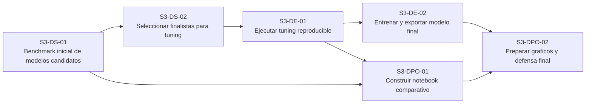

# Tablero de Roles - Sprint 3

## Base usada

Este tablero resume en formato corto lo ya definido en:

- `reports/sprint_03/tickets_sprint_3.md`
- `reports/sprint_03/distribucion_roles_sprint_3.md`

La logica del sprint sigue esta secuencia:

`benchmark -> tuning -> export del modelo final -> notebook y defensa`

## Tarjetas por rol

### Rol 1 - Benchmark y seleccion de modelo

- `S3-DS-01 | Benchmark inicial de modelos candidatos`
  - comparar `LogisticRegression`, `RandomForestClassifier` y `GradientBoosting` o `XGBoost`
  - usar `data/processed/06_features_selected.parquet`
  - mantener split temporal oficial:
    - `train`: `last_purchase < 2018-07-01`
    - `validation`: `last_purchase >= 2018-07-01`
  - reportar `ROC-AUC`, `Gini`, `F1`, `precision` y `recall`

- `S3-DS-02 | Seleccionar 1 o 2 modelos finalistas para tuning`
  - consolidar tabla comparativa reproducible
  - justificar seleccion por AUC y estabilidad entre `train` y `validation`
  - dejar recomendacion tecnica del modelo finalista

**Artefactos esperados**

- `reports/sprint_03/comparacion_modelos.md`
- `data/processed/09_model_benchmark.json`

## Rol 2 - Tuning y export del modelo final

- `S3-DE-01 | Ejecutar tuning reproducible del modelo finalista`
  - definir grilla o espacio de busqueda
  - correr tuning con semilla fija
  - comparar baseline del modelo vs mejor configuracion
  - guardar parametros y metricas ganadoras

- `S3-DE-02 | Entrenar y exportar modelo final reproducible`
  - reentrenar con configuracion final
  - serializar pipeline completo de preprocesamiento + modelo
  - validar que el artefacto cargue y prediga sin errores

**Artefactos esperados**

- `data/processed/10_tuning_results.parquet`
- `data/processed/10_best_model_config.json`
- `reports/sprint_03/tuning_summary.md`
- `models/modelo_final_sprint_3.pkl`
- `data/processed/11_final_model_metrics.json`
- `data/processed/11_feature_importance.parquet`

## Rol 3 - Notebook, graficos y defensa

- `S3-DPO-01 | Construir notebook comparativo del Sprint 3`
  - integrar benchmark y tuning
  - mostrar comparacion entre modelo base y modelo tuned
  - asegurar trazabilidad contra artefactos finales

- `S3-DPO-02 | Preparar graficos y narrativa de defensa`
  - generar curva ROC, matriz de confusion y comparacion de metricas
  - exportar `feature importance`
  - redactar resumen tecnico del modelo ganador

**Artefactos esperados**

- `notebooks/sprint_03_modeling/04_hyperparameter_tuning.ipynb`
- `reports/sprint_03/modelo_final_resumen.md`
- figuras exportadas en `reports/figures/`

## Version compacta para tablero

Si lo quieres pegar directo como tarjetas cortas:

- `S3-DS-01 | Benchmark inicial de modelos candidatos`
- `S3-DS-02 | Seleccionar finalistas para tuning`
- `S3-DE-01 | Ejecutar tuning reproducible`
- `S3-DE-02 | Entrenar y exportar modelo final`
- `S3-DPO-01 | Construir notebook comparativo`
- `S3-DPO-02 | Preparar graficos y defensa final`

## Reparto sugerido para 3 personas

- Persona 1: `S3-DS-01` y `S3-DS-02`
- Persona 2: `S3-DE-01` y `S3-DE-02`
- Persona 3: `S3-DPO-01` y `S3-DPO-02`

## Dependencias entre tarjetas

- `S3-DS-01` no depende de otra tarjeta del Sprint 3.
- `S3-DS-02` depende de `S3-DS-01`.
- `S3-DE-01` depende de `S3-DS-02`.
- `S3-DE-02` depende de `S3-DE-01`.
- `S3-DPO-01` depende parcialmente de `S3-DS-01` y se cierra completamente cuando existen resultados de `S3-DE-01`.
- `S3-DPO-02` depende de `S3-DE-02` y de `S3-DPO-01`.

## Dependencias en formato corto

- `S3-DS-01 -> S3-DS-02`
- `S3-DS-02 -> S3-DE-01`
- `S3-DE-01 -> S3-DE-02`
- `S3-DS-01 -> S3-DPO-01`
- `S3-DE-01 -> S3-DPO-01`
- `S3-DE-02 -> S3-DPO-02`
- `S3-DPO-01 -> S3-DPO-02`

## Diagrama Mermaid

## Lectura operativa

- Persona 1 arranca primero con benchmark y seleccion.
- Persona 2 arranca cuando Persona 1 deja el finalista definido.
- Persona 3 puede empezar estructura y notebook con los resultados iniciales del benchmark, pero la defensa final depende del modelo exportado.

## Tarjetas listas para copiar a Trello

### S3-DS-01 | Benchmark inicial de modelos candidatos

Descripcion:
Comparar modelos candidatos sobre el set oficial de Sprint 2 usando el mismo split temporal para identificar los finalistas.

Checklist:
- Cargar `data/processed/06_features_selected.parquet`
- Respetar split temporal oficial:
  - `train`: `last_purchase < 2018-07-01`
  - `validation`: `last_purchase >= 2018-07-01`
- Entrenar `LogisticRegression`
- Entrenar `RandomForestClassifier`
- Entrenar `GradientBoosting` o `XGBoost` si esta disponible
- Calcular `ROC-AUC`
- Calcular `Gini`
- Calcular `F1`
- Calcular `precision` y `recall`
- Consolidar resultados comparables

Entregables:
- `reports/sprint_03/comparacion_modelos.md`
- `data/processed/09_model_benchmark.json`

Depende de:
- ninguna

### S3-DS-02 | Seleccionar finalistas para tuning

Descripcion:
Elegir `1` o `2` modelos finalistas con base en desempeno y estabilidad entre train y validation.

Checklist:
- Revisar tabla comparativa del benchmark
- Comparar estabilidad entre `train` y `validation`
- Justificar la seleccion por `ROC-AUC`, `Gini` y `F1`
- Definir `1` o `2` modelos finalistas
- Redactar recomendacion tecnica del finalista

Entregables:
- actualizacion de `reports/sprint_03/comparacion_modelos.md`
- decision reflejada en `data/processed/09_model_benchmark.json`

Depende de:
- `S3-DS-01`

### S3-DE-01 | Ejecutar tuning reproducible

Descripcion:
Optimizar hiperparametros del modelo finalista sin romper la logica temporal ni introducir leakage.

Checklist:
- Tomar el modelo finalista definido
- Definir grilla o espacio de busqueda
- Fijar semilla reproducible
- Ejecutar tuning sobre el split oficial
- Comparar baseline del modelo vs mejor configuracion
- Guardar parametros ganadores
- Guardar metricas del tuning
- Redactar resumen del proceso de tuning

Entregables:
- `data/processed/10_tuning_results.parquet`
- `data/processed/10_best_model_config.json`
- `reports/sprint_03/tuning_summary.md`

Depende de:
- `S3-DS-02`

### S3-DE-02 | Entrenar y exportar modelo final

Descripcion:
Reentrenar el modelo ganador con la mejor configuracion y exportar un artefacto reutilizable.

Checklist:
- Reentrenar el modelo con configuracion final
- Serializar pipeline completo de preprocesamiento + modelo
- Guardar modelo en formato `.pkl`
- Validar que el artefacto cargue sin errores
- Validar que el artefacto pueda predecir
- Guardar metricas finales del modelo
- Exportar `feature importance` si aplica

Entregables:
- `models/modelo_final_sprint_3.pkl`
- `data/processed/11_final_model_metrics.json`
- `data/processed/11_feature_importance.parquet`

Depende de:
- `S3-DE-01`

### S3-DPO-01 | Construir notebook comparativo

Descripcion:
Consolidar en un notebook los resultados del benchmark y del tuning con trazabilidad hacia los artefactos finales.

Checklist:
- Crear estructura del notebook final
- Integrar resultados del benchmark
- Integrar resultados del tuning
- Mostrar comparacion modelo base vs modelo tuned
- Verificar consistencia con artefactos generados
- Dejar narrativa tecnica del flujo de modelado

Entregables:
- `notebooks/sprint_03_modeling/04_hyperparameter_tuning.ipynb`

Depende de:
- `S3-DS-01`
- `S3-DE-01`

### S3-DPO-02 | Preparar graficos y defensa final

Descripcion:
Preparar la evidencia visual y narrativa final del Sprint 3 para exposicion y defensa.

Checklist:
- Generar curva ROC
- Generar matriz de confusion
- Generar comparacion de metricas
- Generar visualizacion de `feature importance`
- Redactar resumen tecnico del modelo ganador
- Exportar figuras en `reports/figures/`
- Validar consistencia entre notebook, metricas y modelo final

Entregables:
- `reports/sprint_03/modelo_final_resumen.md`
- figuras exportadas en `reports/figures/`

Depende de:
- `S3-DE-02`
- `S3-DPO-01`
