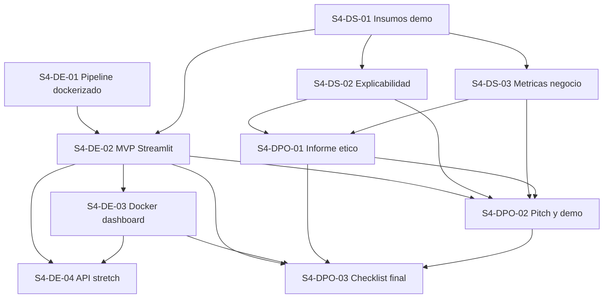

# Plan Sprint 4 - Integracion, despliegue y Demo Day

## Contexto real del repositorio

Con base en el estado actual del proyecto al `13 de junio de 2026`, el repositorio ya tiene:

- pipeline reproducible de datos y features
- modelos serializados en `models/final/`
- estructura prevista para `app/api/`, `app/dashboard/` y `docker/`

Pero tambien muestra estas restricciones reales:

- `app/api/main.py` esta vacio
- `app/dashboard/app.py` esta vacio
- `docker/Dockerfile.api` esta vacio
- `docker/Dockerfile.dashboard` esta vacio
- no hay dependencias declaradas para `fastapi`, `uvicorn`, `streamlit` ni `mlflow` en `pyproject.toml`

## Alcance propuesto para Sprint 4

### Decision de alcance

Para este sprint conviene implementar un MVP con **pipeline reutilizado + Streamlit + Docker**, y no comprometer al equipo a construir al mismo tiempo una API completa y MLflow.

### Lo que si entra al sprint

- reutilizacion del pipeline actual para transformar `holdout_3m`
- `Streamlit app` como interfaz principal del MVP
- carga del modelo oficial `models/final/modelo_final.pkl`
- generacion de un artefacto `holdout_features_selected.parquet` listo para entrar al `.pkl`
- scoring sobre datos transformados y alineados con las features del modelo
- visualizacion de prediccion, probabilidad y variables mas relevantes del cliente
- metricas de negocio resumidas para storytelling
- informe etico y de gobernanza
- pitch final + demo
- contenedor Docker del pipeline
- contenedor Docker del MVP

### Lo que no entra al sprint

- integracion completa con `MLflow`
- monitoreo en produccion
- retraining automatizado
- API productiva completa con autenticacion, validacion avanzada y despliegue independiente

### Decision concreta: dashboard, API o Streamlit

Segun el estado real del codigo, el alcance mas defendible para Sprint 4 es:

**Implementar `Streamlit` como MVP principal, reutilizando el pipeline actual como paso batch previo al scoring.**

Razon:

- ya existe la carpeta `app/dashboard/`
- ya existe un pipeline reutilizable que genera artefactos para `holdout`
- el curso pide un MVP demostrable para `Demo Day`
- una interfaz Streamlit permite mostrar valor de negocio mas rapido que una API sola
- construir `pipeline + Streamlit + Docker` es mas realista para una semana que `API + dashboard + MLflow`

### API en este sprint

La API puede quedar como:

- `opcional / stretch goal`, solo si el dashboard queda estable primero
- o documentada como siguiente paso tecnico posterior al sprint

## Objetivo del sprint

Entregar entre el `17 de junio de 2026` y el `18 de junio de 2026` un MVP navegable para demostrar la identificacion de clientes premium, junto con su narrativa de negocio, consideraciones eticas y empaque reproducible con Docker, reutilizando el pipeline actual para transformar datos de entrada antes del scoring.

## Entregables comprometidos

- pipeline reutilizado para generar un dataset de scoring listo para `modelo_final.pkl`
- artefacto `data/processed/holdout_features_selected.parquet`
- `app/dashboard/app.py` funcional
- `docker-compose.yml` o configuracion equivalente con flujo claro de ejecucion
- `Dockerfile` o configuracion operativa del pipeline reutilizado
- `docker/Dockerfile.dashboard` funcional
- guia de ejecucion local del MVP
- analisis SHAP o explicabilidad equivalente ya resumida para la demo
- informe etico y de gobernanza en `reports/sprint_04/informe_etico_gobernanza.md`
- pitch final en `reports/sprint_04/pitch_demo_day.md`

## Arquitectura funcional propuesta

### Flujo del MVP

```text
holdout_3m crudo
-> pipeline actual reutilizado
-> master table / features transformadas
-> holdout_features_selected.parquet
-> modelo_final.pkl
-> Streamlit
-> demo visual
```

### Rol de cada componente

- `pipeline`: transforma datos crudos y genera features consistentes con entrenamiento
- `holdout_features_selected.parquet`: dataset intermedio con las columnas exactas esperadas por el modelo
- `modelo_final.pkl`: artefacto oficial del Sprint 4; contiene `preprocessor + model` y ejecuta el scoring
- `Streamlit`: carga el `.pkl`, corre la inferencia sobre datos ya transformados y muestra resultados
- `Docker`: empaqueta pipeline y dashboard para ejecucion reproducible

### Decision tecnica clave

`Streamlit` no reemplaza al pipeline.

`Streamlit` no debe recalcular todo el ETL pesado en cada interaccion.

La app debe consumir datos que ya pasaron por el pipeline o una muestra preparada a partir de ese pipeline.

Para evitar inconsistencias, el pipeline debe dejar una salida intermedia con las features seleccionadas y ordenadas segun el esquema esperado por `models/final/modelo_final.pkl`.

## Distribucion del trabajo para 3 personas

## Convencion de identificadores

Para mantener consistencia con Trello y con el Sprint 3, se propone usar:

- `S4-DE-XX` para tareas del `Data Engineer`
- `S4-DS-XX` para tareas del `Data Scientist`
- `S4-DPO-XX` para tareas del `Data Product Owner`

## Persona 1 - Ingenieria de integracion y despliegue

### S4-DE-01 - Dockerizar y operar el pipeline reutilizado

**Responsable:** Persona 1  
**Prioridad:** Alta  
**Depende de:** codigo actual de pipeline y datos `holdout_3m`

#### Subtareas

- revisar y validar reutilizacion de:
  - `src/data/build_master_table.py`
  - `src/features/build_rfm_features.py`
  - `scripts/build_features.sh`
- definir como se ejecutara el pipeline para `holdout_3m`
- agregar paso de alineacion a features seleccionadas del modelo
- adaptar o documentar el contenedor que empaqueta el pipeline
- validar entradas y salidas esperadas del pipeline
- dejar documentado el comando que genera los artefactos de demo
- fijar compatibilidad del entorno que cargara `modelo_final.pkl`:
  - misma version de Python y librerias del artefacto
  - o regeneracion controlada del `.pkl` en el entorno final del sprint
- asegurar que el pipeline produzca:
  - `holdout_features_rfm.parquet`
  - `holdout_features_selected.parquet`
  - dataset listo para `modelo_final.pkl`

#### Criterio de cierre

El pipeline corre de forma reproducible sobre `holdout_3m` y deja un artefacto alineado con las columnas esperadas por `modelo_final.pkl`.

### S4-DE-02 - Construir el MVP en Streamlit

**Responsable:** Persona 1  
**Prioridad:** Alta  
**Depende de:** `S4-DE-01` y disponibilidad del modelo final

#### Subtareas

- usar `models/final/modelo_final.pkl` como artefacto oficial de inferencia
- implementar carga de `modelo_final.pkl`
- implementar lectura de `holdout_features_selected.parquet`
- crear vista principal con:
  - selector de cliente o registro
  - prediccion premium / no premium
  - score o probabilidad
  - variables relevantes del caso
- agregar manejo de errores si falta modelo o columnas
- dejar script de ejecucion para demo

#### Criterio de cierre

La app corre localmente y permite mostrar al menos un caso positivo y uno negativo de forma estable.

### S4-DE-03 - Dockerizar el MVP Streamlit

**Responsable:** Persona 1  
**Prioridad:** Alta  
**Depende de:** `S4-DE-02`

#### Subtareas

- completar `docker/Dockerfile.dashboard`
- ajustar dependencias necesarias para la app
- definir comando de arranque del dashboard
- validar carga de `modelo_final.pkl` dentro del contenedor sin incompatibilidades de version
- validar que el contenedor levante el MVP
- documentar como ejecutar la demo con Docker

#### Criterio de cierre

El dashboard puede levantarse de forma reproducible con Docker.

### S4-DE-04 - API como stretch goal

**Responsable:** Persona 1  
**Prioridad:** Baja  
**Depende de:** `S4-DE-02` y `S4-DE-03`

#### Subtareas

- crear endpoint minimo `/health`
- crear endpoint minimo `/predict`
- documentar request/response esperado

#### Criterio de cierre

Solo se ejecuta si el dashboard ya esta terminado y probado.

## Persona 2 - Ciencia de datos, explicabilidad y validacion

### S4-DS-01 - Preparar insumos analiticos para el MVP

**Responsable:** Persona 2  
**Prioridad:** Alta  
**Depende de:** artefactos ya producidos en Sprint 3

#### Subtareas

- declarar `models/final/modelo_final.pkl` como modelo oficial de la demo
- preparar dataset o muestra de scoring para exhibicion a partir de `holdout_features_selected.parquet`
- validar las columnas exactas que necesita `modelo_final.pkl`
- confirmar la regla final de decision para demo:
  - uso de `predict()` directo
  - o uso de `predict_proba()` con umbral explicito acordado
- generar 2 a 5 casos ejemplo para demo
- verificar consistencia entre features del modelo y datos de entrada

#### Criterio de cierre

Existe un conjunto de ejemplos demo reutilizable y coherente con el modelo elegido.

### S4-DS-02 - Explicabilidad y analisis SHAP

**Responsable:** Persona 2  
**Prioridad:** Alta  
**Depende de:** `S4-DS-01`

#### Subtareas

- reutilizar importancias y auditorias existentes de Sprint 3
- calcular o resumir SHAP / feature importance del modelo final
- seleccionar insights entendibles para negocio
- preparar visuales o tablas para incrustar en la demo y el pitch

#### Criterio de cierre

La demo puede explicar por que un cliente fue clasificado como premium con evidencia interpretable.

### S4-DS-03 - Metricas de negocio para storytelling

**Responsable:** Persona 2  
**Prioridad:** Media  
**Depende de:** `S4-DS-01`

#### Subtareas

- traducir metricas tecnicas a impacto negocio
- proponer KPI demo:
  - porcentaje de clientes premium detectados
  - gasto acumulado capturado por el segmento premium
  - utilidad potencial de focalizar campañas
- preparar una tabla simple para presentacion ejecutiva

#### Criterio de cierre

El pitch cuenta con al menos 3 metricas de negocio conectadas al modelo.

## Persona 3 - Producto, gobernanza y presentacion final

### S4-DPO-01 - Informe etico y de gobernanza

**Responsable:** Persona 3  
**Prioridad:** Alta  
**Depende de:** `S4-DS-02` y `S4-DS-03`

#### Subtareas

- describir uso previsto del modelo y limites del MVP
- analizar riesgos de sesgo por:
  - geografia
  - capacidad de pago
  - historial incompleto
- documentar riesgos de privacidad por uso de datos transaccionales
- proponer controles minimos:
  - trazabilidad del dataset
  - versionado manual del modelo
  - revision humana para decisiones comerciales sensibles
- redactar recomendaciones para siguiente iteracion

#### Criterio de cierre

Existe un informe breve y defendible de 2 a 3 paginas.

### S4-DPO-02 - Storytelling y pitch Demo Day

**Responsable:** Persona 3  
**Prioridad:** Alta  
**Depende de:** `S4-DE-02`, `S4-DS-02`, `S4-DS-03` y `S4-DPO-01`

#### Subtareas

- estructurar narrativa problema -> solucion -> evidencia -> impacto
- preparar guion de demo de 5 a 7 minutos
- asignar quien presenta cada bloque
- consolidar capturas, metricas y mensajes clave
- preparar respuestas a preguntas tecnicas y de negocio

#### Criterio de cierre

El equipo puede ejecutar una demo corta, coherente y repartida entre los 3 integrantes.

### S4-DPO-03 - Coordinacion y checklist final

**Responsable:** Persona 3  
**Prioridad:** Media  
**Depende de:** avance de todas las tareas principales

#### Subtareas

- verificar consistencia entre app, metricas e informe
- validar que los entregables esten en rutas finales del repo
- cerrar checklist de demo
- coordinar ensayo final

#### Criterio de cierre

No hay contradicciones entre lo tecnico, lo ejecutivo y lo etico.

## Dependencias entre tareas

### Resumen textual

- `S4-DE-01` habilita `S4-DE-02`
- `S4-DE-02` habilita `S4-DE-03`
- `S4-DS-01` alimenta `S4-DE-02`, `S4-DS-02` y `S4-DS-03`
- `S4-DS-02` y `S4-DS-03` habilitan `S4-DPO-01`
- `S4-DE-02`, `S4-DS-02`, `S4-DS-03` y `S4-DPO-01` habilitan `S4-DPO-02`
- `S4-DPO-03` depende del cierre integrado de app, narrativa e informe
- `S4-DE-04` solo se toma si `S4-DE-02` y `S4-DE-03` ya cerraron

### Mermaid



## Secuencia sugerida del sprint

```text
S4-DE-01 Pipeline reutilizado y dockerizado
-> S4-DS-01 Insumos demo
-> S4-DE-02 MVP Streamlit
-> S4-DE-03 Docker

En paralelo:
S4-DS-02 Explicabilidad
S4-DS-03 Metricas de negocio

Luego:
S4-DPO-01 Informe etico
-> S4-DPO-02 Pitch Demo Day
-> S4-DPO-03 Checklist final

Stretch:
S4-DE-04 API minima
```

## Cronograma sugerido por dia

### Dia 1 - Pipeline y definicion tecnica

- `S4-DE-01`: validar pipeline reutilizado sobre `holdout_3m`
- `S4-DE-01`: definir salida `holdout_features_selected.parquet`
- `S4-DE-01`: revisar compatibilidad de entorno para `modelo_final.pkl`
- `S4-DS-01`: confirmar `modelo_final.pkl` como artefacto oficial
- `S4-DS-01`: validar columnas esperadas por el modelo

### Dia 2 - Dataset de scoring y app base

- `S4-DE-01`: cerrar generacion de artefactos de scoring
- `S4-DS-01`: preparar muestra demo y casos ejemplo
- `S4-DE-02`: implementar app base en Streamlit
- `S4-DE-02`: cargar `modelo_final.pkl` y leer `holdout_features_selected.parquet`

### Dia 3 - Prediccion, explicabilidad y Docker

- `S4-DE-02`: cerrar scoring visible en la app
- `S4-DS-01`: confirmar regla final de decision de la demo
- `S4-DS-02`: preparar explicabilidad y visuales
- `S4-DE-03`: completar `docker/Dockerfile.dashboard`
- `S4-DE-03`: validar carga del modelo dentro del contenedor

### Dia 4 - Integracion final y ensayo tecnico

- `S4-DE-03`: cerrar ejecucion reproducible con Docker
- `S4-DS-03`: consolidar metricas de negocio
- `S4-DPO-03`: checklist tecnico funcional
- `S4-DPO-02`: estructurar guion de demo
- ensayo tecnico corto del flujo completo:
  - pipeline
  - dataset seleccionado
  - scoring
  - dashboard

### Dia 5 - Informe y diapositivas

- `S4-DPO-01`: redactar y cerrar informe etico y de gobernanza
- `S4-DPO-02`: consolidar storytelling final
- preparar diapositivas finales
- agregar capturas de la app, metricas y mensajes clave
- ensayo general del pitch
- si sobra tiempo, evaluar `S4-DE-04` como stretch goal

## Capacidad estimada del sprint

### Alcance comprometido

- un MVP de `Streamlit` demostrable
- un pipeline reutilizado para transformar `holdout_3m`
- un artefacto `holdout_features_selected.parquet` listo para `modelo_final.pkl`
- un contenedor Docker del MVP
- un contenedor o ejecucion reproducible del pipeline
- soporte narrativo con metricas de negocio
- informe etico y de gobernanza
- pitch final con demo

### Alcance no comprometido

- `MLflow`
- observabilidad real de produccion
- CI/CD
- API completa desacoplada del dashboard
- dashboard avanzado con analitica historica compleja

## Riesgos del sprint

- falta de dependencias declaradas para Streamlit y despliegue
- diferencias entre columnas del modelo entrenado y datos de demo
- incompatibilidad entre el entorno Docker y `modelo_final.pkl`
- inconsistencia entre el umbral documentado del modelo y el umbral usado en la demo
- sobrecarga si se intenta hacer `dashboard + API + Docker + MLflow` en la misma semana
- falta de tiempo para ensayo si la integracion tecnica se retrasa

## Recomendacion final

Para este proyecto, Sprint 4 debe vender una historia simple y creible:

1. ya tenemos el modelo final
2. reutilizamos el pipeline actual para transformar `holdout_3m`
3. generamos `holdout_features_selected.parquet` listo para `modelo_final.pkl`
4. exponemos el scoring en un `Streamlit MVP`
5. empaquetamos pipeline y app con `Docker`
6. explicamos impacto de negocio y riesgos eticos
7. dejamos `MLflow` y una `API completa` como siguiente iteracion

Ese alcance es consistente con el estado real del repositorio y con la capacidad de un equipo de 3 personas en la ultima semana.
