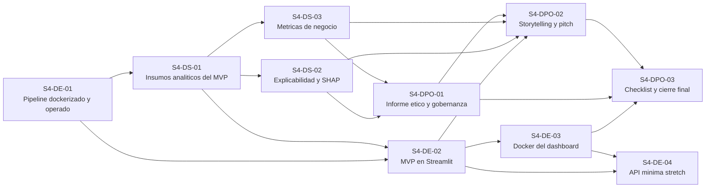

# Tablero de Roles - Sprint 4

## Base usada

Este tablero resume en formato Trello lo ya definido en:

- `reports/sprint_04/plan_sprint_4.md`

La logica del sprint sigue esta secuencia:

`pipeline holdout -> features selected -> scoring con modelo_final.pkl -> Streamlit -> Docker -> informe y pitch`

## Fechas del sprint

- Inicio operativo: `miercoles, 17 de junio de 2026`
- Cierre esperado de tickets: `jueves, 18 de junio de 2026`

## Version compacta para tablero

Si lo quieres pegar directo como tarjetas cortas:

- `S4-DE-01 | Dockerizar y operar pipeline reutilizado`
- `S4-DS-01 | Preparar insumos analiticos del MVP`
- `S4-DE-02 | Construir MVP en Streamlit`
- `S4-DS-02 | Preparar explicabilidad y SHAP`
- `S4-DS-03 | Consolidar metricas de negocio`
- `S4-DE-03 | Dockerizar MVP Streamlit`
- `S4-DPO-01 | Redactar informe etico y gobernanza`
- `S4-DPO-02 | Preparar storytelling y pitch Demo Day`
- `S4-DPO-03 | Ejecutar checklist y cierre final`
- `S4-DE-04 | API minima como stretch goal`

## Reparto sugerido para 3 personas

- Persona 1: `S4-DE-01`, `S4-DE-02`, `S4-DE-03`, `S4-DE-04`
- Persona 2: `S4-DS-01`, `S4-DS-02`, `S4-DS-03`
- Persona 3: `S4-DPO-01`, `S4-DPO-02`, `S4-DPO-03`

## Dependencias entre tarjetas

- `S4-DE-01` no depende de otra tarjeta del Sprint 4.
- `S4-DS-01` arranca con artefactos de Sprint 3 y se apoya en la salida de `S4-DE-01`.
- `S4-DE-02` depende de `S4-DE-01` y del insumo validado en `S4-DS-01`.
- `S4-DS-02` depende de `S4-DS-01`.
- `S4-DS-03` depende de `S4-DS-01`.
- `S4-DE-03` depende de `S4-DE-02`.
- `S4-DPO-01` depende de `S4-DS-02` y `S4-DS-03`.
- `S4-DPO-02` depende de `S4-DE-02`, `S4-DS-02`, `S4-DS-03` y `S4-DPO-01`.
- `S4-DPO-03` depende del cierre de `S4-DE-03`, `S4-DPO-01` y `S4-DPO-02`.
- `S4-DE-04` depende de `S4-DE-02` y `S4-DE-03`.

## Dependencias en formato corto

- `S4-DE-01 -> S4-DS-01`
- `S4-DE-01 -> S4-DE-02`
- `S4-DS-01 -> S4-DE-02`
- `S4-DS-01 -> S4-DS-02`
- `S4-DS-01 -> S4-DS-03`
- `S4-DE-02 -> S4-DE-03`
- `S4-DS-02 -> S4-DPO-01`
- `S4-DS-03 -> S4-DPO-01`
- `S4-DE-02 -> S4-DPO-02`
- `S4-DS-02 -> S4-DPO-02`
- `S4-DS-03 -> S4-DPO-02`
- `S4-DPO-01 -> S4-DPO-02`
- `S4-DE-03 -> S4-DPO-03`
- `S4-DPO-01 -> S4-DPO-03`
- `S4-DPO-02 -> S4-DPO-03`
- `S4-DE-02 -> S4-DE-04`
- `S4-DE-03 -> S4-DE-04`

## Diagrama Mermaid

## Tarjetas listas para copiar a Trello

### S4-DE-01 | Dockerizar y operar pipeline reutilizado

Descripcion:
Reutilizar el pipeline actual para transformar `holdout_3m` y dejar un artefacto `holdout_features_selected.parquet` listo para inferencia con `models/final/modelo_final.pkl`.

Checklist:
- Revisar `src/data/build_master_table.py`
- Revisar `src/features/build_rfm_features.py`
- Revisar `scripts/build_features.sh`
- Definir flujo batch para `holdout_3m`
- Agregar paso de alineacion a features seleccionadas
- Generar `holdout_features_rfm.parquet`
- Generar `holdout_features_selected.parquet`
- Validar que el artefacto final sea compatible con `modelo_final.pkl`
- Fijar compatibilidad de entorno o regeneracion controlada del `.pkl`
- Documentar comando de generacion de artefactos demo

Entregables:
- `data/processed/holdout_features_rfm.parquet`
- `data/processed/holdout_features_selected.parquet`
- documentacion operativa del pipeline reutilizado

Depende de:
- ninguna

Deadline:
- abre: `miercoles, 17 de junio de 2026, 00:00`
- pendiente: `miercoles, 17 de junio de 2026, 23:59`

### S4-DS-01 | Preparar insumos analiticos del MVP

Descripcion:
Definir el artefacto oficial de inferencia, validar las columnas requeridas por el modelo y preparar la muestra de scoring que usara la demo.

Checklist:
- Declarar `models/final/modelo_final.pkl` como artefacto oficial
- Validar columnas exactas esperadas por el modelo
- Preparar muestra desde `holdout_features_selected.parquet`
- Generar `2` a `5` casos ejemplo para demo
- Confirmar regla final de decision:
  - `predict()` directo
  - o `predict_proba()` con umbral explicito
- Verificar consistencia entre datos de entrada y modelo

Entregables:
- muestra demo para scoring
- definicion del criterio de decision del modelo

Depende de:
- `S4-DE-01`

Deadline:
- abre: `miercoles, 17 de junio de 2026, 12:00`
- pendiente: `jueves, 18 de junio de 2026, 10:00`

### S4-DE-02 | Construir MVP en Streamlit

Descripcion:
Construir la aplicacion Streamlit que cargue `modelo_final.pkl`, lea `holdout_features_selected.parquet` y muestre prediccion, score y variables relevantes.

Checklist:
- Crear estructura base de `app/dashboard/app.py`
- Cargar `models/final/modelo_final.pkl`
- Leer `data/processed/holdout_features_selected.parquet`
- Implementar selector de cliente o registro
- Mostrar prediccion premium / no premium
- Mostrar score o probabilidad
- Mostrar variables relevantes del caso
- Manejar errores por columnas faltantes o artefactos ausentes
- Validar al menos un caso positivo y uno negativo

Entregables:
- `app/dashboard/app.py`
- MVP local funcional

Depende de:
- `S4-DE-01`
- `S4-DS-01`

Deadline:
- abre: `jueves, 18 de junio de 2026, 00:00`
- pendiente: `jueves, 18 de junio de 2026, 23:59`

### S4-DS-02 | Preparar explicabilidad y SHAP

Descripcion:
Preparar la explicabilidad del modelo para la demo reutilizando importancias y auditorias del Sprint 3 y, si aplica, resumen SHAP del modelo final.

Checklist:
- Reutilizar importancias del Sprint 3
- Reutilizar auditorias de features del Sprint 3
- Calcular o resumir SHAP / feature importance
- Seleccionar insights entendibles para negocio
- Preparar tabla o visual para la demo

Entregables:
- resumen de explicabilidad para demo
- visual o tabla reutilizable en pitch

Depende de:
- `S4-DS-01`

Deadline:
- abre: `jueves, 18 de junio de 2026, 12:00`
- pendiente: `jueves, 18 de junio de 2026, 18:00`

### S4-DS-03 | Consolidar metricas de negocio

Descripcion:
Traducir las metricas tecnicas del modelo a una narrativa de valor de negocio util para el Demo Day.

Checklist:
- Traducir metricas tecnicas a impacto de negocio
- Calcular porcentaje de clientes premium detectados
- Calcular gasto capturado por el segmento premium
- Estimar utilidad potencial de focalizar campanas
- Preparar tabla ejecutiva de KPIs

Entregables:
- tabla de KPIs de negocio
- resumen ejecutivo de impacto

Depende de:
- `S4-DS-01`

Deadline:
- abre: `jueves, 18 de junio de 2026, 08:00`
- pendiente: `jueves, 18 de junio de 2026, 20:00`

### S4-DE-03 | Dockerizar MVP Streamlit

Descripcion:
Empaquetar la app Streamlit en Docker y validar que `modelo_final.pkl` cargue sin problemas de compatibilidad dentro del contenedor.

Checklist:
- Completar `docker/Dockerfile.dashboard`
- Agregar dependencias necesarias para Streamlit
- Definir comando de arranque del dashboard
- Validar carga de `modelo_final.pkl` dentro del contenedor
- Validar ejecucion del MVP con Docker
- Documentar comando de uso para demo

Entregables:
- `docker/Dockerfile.dashboard`
- dashboard ejecutable con Docker

Depende de:
- `S4-DE-02`

Deadline:
- abre: `jueves, 18 de junio de 2026, 08:00`
- pendiente: `jueves, 18 de junio de 2026, 23:00`

### S4-DPO-01 | Redactar informe etico y gobernanza

Descripcion:
Redactar el informe etico y de gobernanza del MVP, cubriendo sesgos, privacidad y controles minimos de uso del modelo.

Checklist:
- Describir uso previsto y limites del MVP
- Analizar riesgos por geografia
- Analizar riesgos por capacidad de pago
- Analizar riesgos por historial incompleto
- Documentar riesgos de privacidad
- Proponer trazabilidad del dataset
- Proponer versionado manual del modelo
- Proponer revision humana en decisiones sensibles
- Redactar recomendaciones para siguiente iteracion

Entregables:
- `reports/sprint_04/informe_etico_gobernanza.md`

Depende de:
- `S4-DS-02`
- `S4-DS-03`

Deadline:
- abre: `jueves, 18 de junio de 2026, 08:00`
- pendiente: `jueves, 18 de junio de 2026, 20:00`

### S4-DPO-02 | Preparar storytelling y pitch Demo Day

Descripcion:
Preparar el guion de demo, la narrativa ejecutiva y la articulacion final entre problema, evidencia, impacto y solucion.

Checklist:
- Estructurar narrativa problema -> solucion -> evidencia -> impacto
- Preparar guion de demo de `5` a `7` minutos
- Asignar presentador por bloque
- Consolidar capturas y metricas clave
- Preparar respuestas a preguntas tecnicas y de negocio
- Ensayar pitch completo

Entregables:
- `reports/sprint_04/pitch_demo_day.md`
- guion final de presentacion

Depende de:
- `S4-DE-02`
- `S4-DS-02`
- `S4-DS-03`
- `S4-DPO-01`

Deadline:
- abre: `jueves, 18 de junio de 2026, 12:00`
- pendiente: `jueves, 18 de junio de 2026, 22:00`

### S4-DPO-03 | Ejecutar checklist y cierre final

Descripcion:
Cerrar el sprint verificando consistencia entre pipeline, app, metricas, informe y presentacion final.

Checklist:
- Verificar consistencia entre app e informe
- Verificar consistencia entre metricas y pitch
- Confirmar rutas finales de entregables
- Ejecutar checklist de demo completa
- Coordinar ensayo final
- Registrar pendientes de ultimo momento

Entregables:
- checklist final de cierre
- validacion final de entregables del sprint

Depende de:
- `S4-DE-03`
- `S4-DPO-01`
- `S4-DPO-02`

Deadline:
- abre: `jueves, 18 de junio de 2026, 18:00`
- pendiente: `jueves, 18 de junio de 2026, 23:59`

### S4-DE-04 | API minima como stretch goal

Descripcion:
Implementar una API minima solo si el dashboard y Docker ya estan cerrados, dejando un endpoint de salud y uno basico de prediccion.

Checklist:
- Crear endpoint `/health`
- Crear endpoint `/predict`
- Documentar request y response

Entregables:
- implementacion minima de API
- documentacion basica de consumo

Depende de:
- `S4-DE-02`
- `S4-DE-03`

Deadline:
- abre: `jueves, 18 de junio de 2026, 18:00`
- pendiente: `jueves, 18 de junio de 2026, 23:59`

## Lectura operativa

- Persona 1 arranca primero con el pipeline reutilizado y deja listo el dataset `holdout_features_selected.parquet`.
- Persona 2 entra en paralelo apenas existe ese artefacto y fija tanto el insumo demo como la regla final de decision.
- Persona 1 continua con Streamlit y luego Docker.
- Persona 3 entra fuerte desde el cierre tecnico del sabado hacia el domingo con informe, pitch y cierre.
- `S4-DE-04` solo se intenta si no compromete el cierre del Demo Day.
